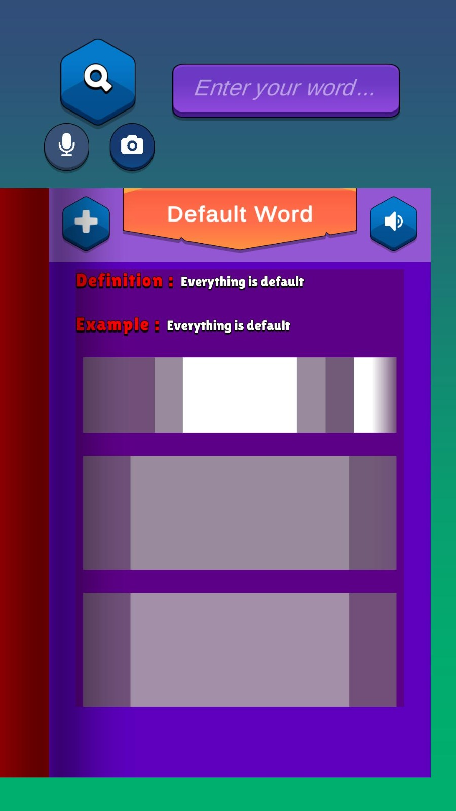
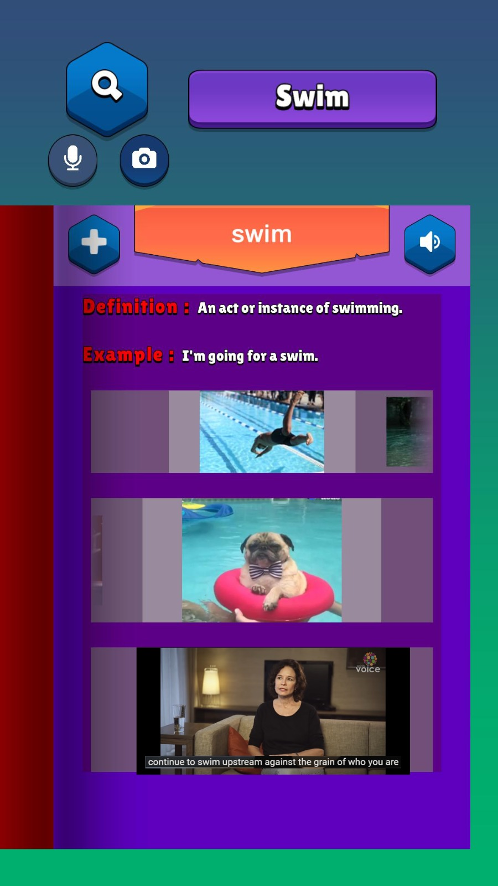
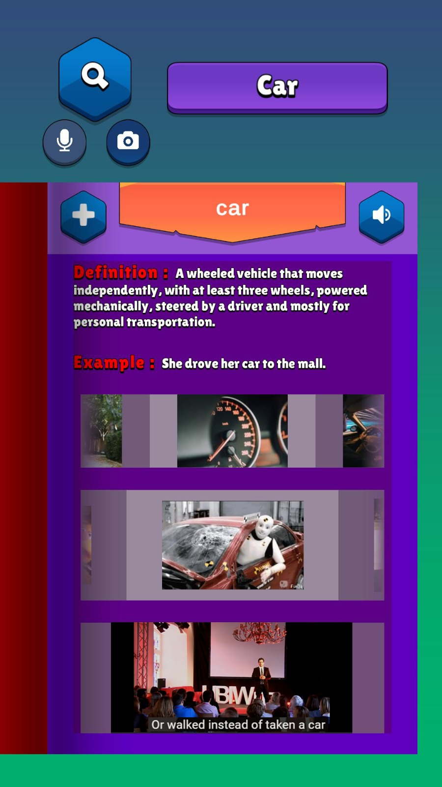
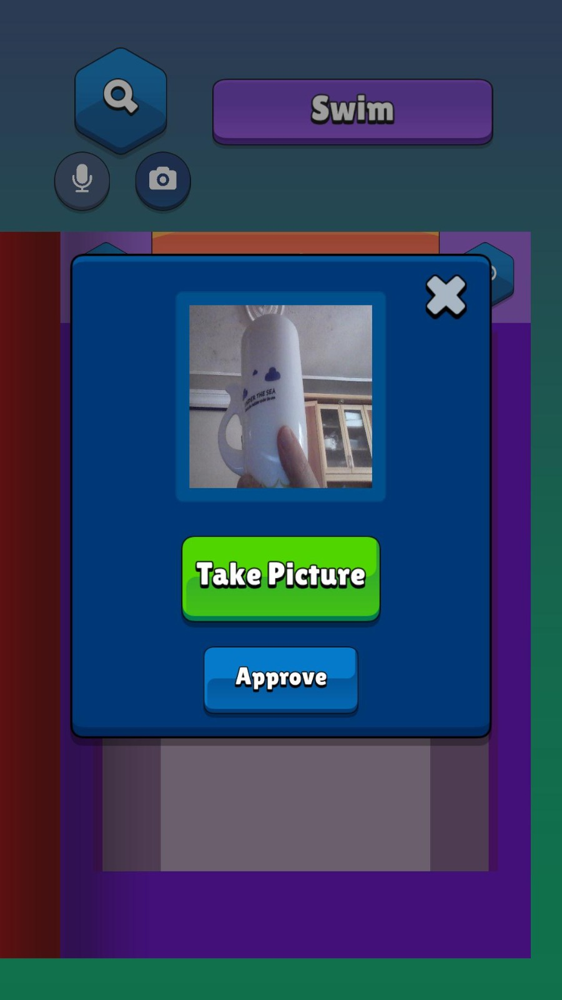
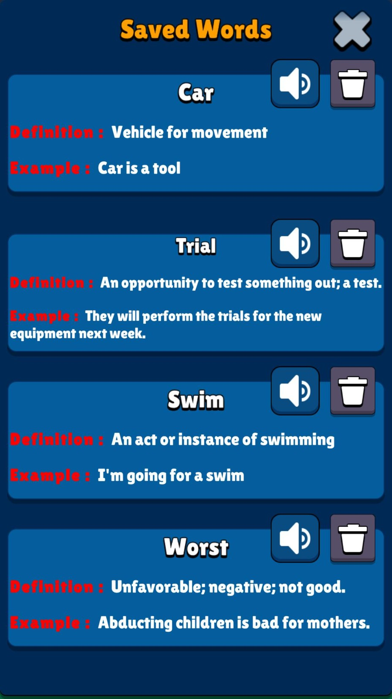

# Augment Reality Supported Dictionary (AGSOZ)

[![Contributors][contributors-shield]][contributors-url]
[![Forks][forks-shield]][forks-url]
[![Stargazers][stars-shield]][stars-url]
[![Issues][issues-shield]][issues-url]
<head>
  <title>English Learner Assistant Dictionary Demo</title>
</head>
<body>
  <h1>English Learner Assistant Dictionary Demo</h1>
  
This app is a demo of an English Learner Assistant Dictionary, which is supported by Tubitak.

</body>

<!-- ABOUT THE PROJECT -->
## About The Project

The use of smart devices is increasing day by day. These devices make our daily lives much easier. However, in this age where notifications greatly affect our lives, the concept of learning through technology is not as popular as the other innovations brought by smart devices. This situation reduces the role of learning in technology and serves a different purpose than simplifying our lives. Learning and the learning process are still quite challenging, especially for concepts such as a foreign language. Although existing applications are helpful in this regard, they are insufficient in terms of examples and variety. In this project, an augmented reality-based dictionary application was developed. AGSOZ, the name of this application, aims to increase the variety of examples and suggestions to make this process more fun and easy. With the easy interface and clear options provided in AGSOZ, learning will become continuous and users will be able to make significant progress in their learning process. AGSOZ is suitable for all ages, so every filtering and suggestion process made within the project is age-independent. Therefore, notifications and word suggestions to users are based on the user's data in the application. AGSOZ has a simple interface and clear search options, which are: voice search, image search, and text search. When the user presses the voice search button, he speaks, and this voice is converted into text. When the user presses the image search button, he takes a picture of the object, and the word corresponding to this picture is found by processing the image. These words are printed in the search box on the screen. The user can also manually write a word in the search box. Voice search consists of two steps, one is recording the user's voice, and the other is processing this voice and converting it into a word. In the first step, the recorded sound is processed by Unity Asset Store's Speech Recogniton System, and a string is obtained by converting this sound into text. In the second step, this string is converted into a word by comparing it with the words in the dictionary. The user can also use the image search to find the words corresponding to the images he has taken. The images taken by the user are processed by Unity Asset Store's OpenCV for Unity and the words corresponding to these images are found. Finally, the words found by both methods are printed in the search box, and suggestions are made to the user.

  

  

    

<!-- SETUP AND USAGE -->
## Setup and Usage

To run Zombie Runner, follow these steps:

1. Clone or download the repository to your local machine
2. Open the project in your preferred game engine
3. Click the "Run" button to start the game

<!-- BUILT WITH -->
## Built With

Zombie Runner was built using the following technologies and tools:

- Unity3d
- C# for logic and mechanics
- Various assets and resources from the Unity Asset Store
- Speech Recognition System and OpenCV for Unity from the Unity Asset Store

[contributors-shield]: https://img.shields.io/github/contributors/AbdullahAskin/AGSOZ.svg?style=for-the-badge
[contributors-url]: https://github.com/AbdullahAskin/AGSOZ/graphs/contributors
[forks-shield]: https://img.shields.io/github/forks/AbdullahAskin/AGSOZ.svg?style=for-the-badge
[forks-url]: https://github.com/AbdullahAskin/AGSOZ/network/members
[stars-shield]: https://img.shields.io/github/stars/AbdullahAskin/AGSOZ.svg?style=for-the-badge
[stars-url]: https://github.com/AbdullahAskin/AGSOZ/stargazers
[issues-shield]: https://img.shields.io/github/issues/AbdullahAskin/AGSOZ.svg?style=for-the-badge
[issues-url]: https://github.com/AbdullahAskin/AGSOZ/issues
[linkedin-shield]: https://img.shields.io/badge/-LinkedIn-black.svg?style=for-the-badge&logo=linkedin&colorB=555
[linkedin-url]: www.linkedin.com/in/abdullah-ahmet-askin
